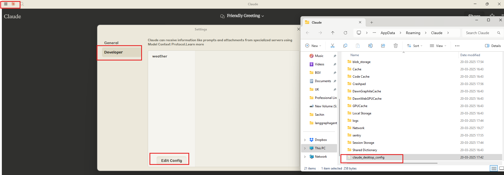
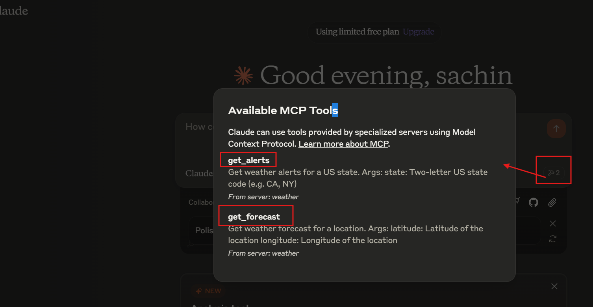
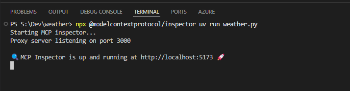
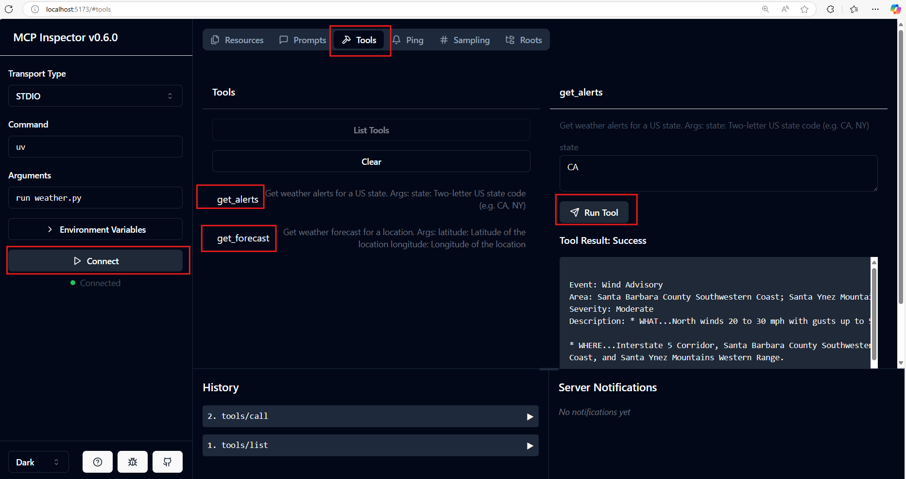

MCP Weather Server Quickstart

## Overview

This document provides a comprehensive guide to building a simple Model Context Protocol (MCP) weather server and connecting it to a host, Claude for Desktop. The server exposes two tools: `get-alerts` and `get-forecast`, which fetch weather alerts and forecasts using the National Weather Service API.

## Table of Contents

1.  [Introduction](#introduction)
2.  [Prerequisites](#prerequisites)
3.  [System Requirements](#system-requirements)
4.  [Setup](#setup)
5.  [Building the Server](#building-the-server)
    - [Importing Packages and Setting Up the Instance](#importing-packages-and-setting-up-the-instance)
    - [Helper Functions](#helper-functions)
    - [Implementing Tool Execution](#implementing-tool-execution)
    - [Running the Server](#running-the-server)
6.  [Testing with Claude for Desktop](#testing-your-server-with-claude-for-desktop)
    - [Configuration](#configuration)
    - [Test with Commands](#test-with-commands)
7.  [Under the Hood](#what’s-happening-under-the-hood)
8.  [Troubleshooting](#troubleshooting)


## Introduction

This guide walks you through creating an MCP server to enhance LLMs (like Claude) with real-time weather data. The server utilizes the MCP framework to expose tools for fetching weather alerts and forecasts, addressing the LLM's lack of native environmental awareness.

## Prerequisites

Before starting, ensure you have:

- Familiarity with Python
- Understanding of LLMs like Claude

## System Requirements

- Python 3.10 or higher
- MCP SDK 1.2.0 or higher

## Setup

1.  **Install `uv`:**

    window
    ```
    powershell -ExecutionPolicy ByPass -c "irm https://astral.sh/uv/install.ps1 | iex"
    ```
    macos/linux
     ```
    curl -LsSf https://astral.sh/uv/install.sh | sh
    ```


    Restart your terminal to ensure the `uv` command is recognized.

2.  **Create and Set Up Project:**

    window(cd to your dev repo_path run below command in powershell/..)

    ```
    # Create a new directory for our project
      uv init weather
      cd weather

      # Create virtual environment and activate it
      uv venv
      .venv\Scripts\activate

      # Install dependencies
      uv add mcp[cli] httpx

      # Create our server file
      new-item weather.py
    ```
    macos/linux
      ```
      # Create a new directory for our project
      uv init weather
      cd weather

      # Create virtual environment and activate it
      uv venv
      source .venv/bin/activate

      # Install dependencies
      uv add "mcp[cli]" httpx

      # Create our server file
      touch weather.py

    ```


## Building the Server

### Importing Packages and Setting Up the Instance

Add the following code to the top of your `weather.py` file:
```
from typing import Any
import httpx
from mcp.server.fastmcp import FastMCP


# Initialize FastMCP server
mcp = FastMCP("weather")

# Constants
NWS_API_BASE = "https://api.weather.gov"
USER_AGENT = "weather-app/1.0"


#helper function
async def make_nws_request(url: str) -> dict[str, Any] | None:
    """Make a request to the NWS API with proper error handling."""
    headers = {
        "User-Agent": USER_AGENT,
        "Accept": "application/geo+json"
    }
    async with httpx.AsyncClient() as client:
        try:
            response = await client.get(url, headers=headers, timeout=30.0)
            response.raise_for_status()
            return response.json()
        except Exception:
            return None

def format_alert(feature: dict) -> str:
    """Format an alert feature into a readable string."""
    props = feature["properties"]
    return f"""
Event: {props.get('event', 'Unknown')}
Area: {props.get('areaDesc', 'Unknown')}
Severity: {props.get('severity', 'Unknown')}
Description: {props.get('description', 'No description available')}
Instructions: {props.get('instruction', 'No specific instructions provided')}
"""


@mcp.tool()
async def get_alerts(state: str) -> str:
    """Get weather alerts for a US state.

    Args:
        state: Two-letter US state code (e.g. CA, NY)
    """
    url = f"{NWS_API_BASE}/alerts/active/area/{state}"
    data = await make_nws_request(url)

    if not data or "features" not in data:
        return "Unable to fetch alerts or no alerts found."

    if not data["features"]:
        return "No active alerts for this state."

    alerts = [format_alert(feature) for feature in data["features"]]
    return "\n---\n".join(alerts)

@mcp.tool()
async def get_forecast(latitude: float, longitude: float) -> str:
    """Get weather forecast for a location.

    Args:
        latitude: Latitude of the location
        longitude: Longitude of the location
    """
    # First get the forecast grid endpoint
    points_url = f"{NWS_API_BASE}/points/{latitude},{longitude}"
    points_data = await make_nws_request(points_url)

    if not points_data:
        return "Unable to fetch forecast data for this location."

    # Get the forecast URL from the points response
    forecast_url = points_data["properties"]["forecast"]
    forecast_data = await make_nws_request(forecast_url)

    if not forecast_data:
        return "Unable to fetch detailed forecast."

    # Format the periods into a readable forecast
    periods = forecast_data["properties"]["periods"]
    forecasts = []
    for period in periods[:5]:  # Only show next 5 periods
        forecast = f"""
                    {period['name']}:
                    Temperature: {period['temperature']}°{period['temperatureUnit']}
                    Wind: {period['windSpeed']} {period['windDirection']}
                    Forecast: {period['detailedForecast']}
                    """
        forecasts.append(forecast)

    return "\n---\n".join(forecasts)


if __name__ == "__main__":
    # Initialize and run the server
    mcp.run(transport='stdio')
```

### Running the Server
To verify your server, run:

```
uv run weather.py

```

## Testing Your Server with Claude for Desktop

### Configuration

1.  **Install/Update Claude for Desktop:** Ensure you have the latest version installed.
2.  **Configure MCP Servers:** Open or create the configuration file at `~/Library/Application Support/Claude/claude_desktop_config.json`.



  -> **RESTART THE SYSTEM IF NOT WORKS**

3.  **Add Server Configuration:**

    ```
    {
      "mcpServers": {
        "weather": {
          "command": "uv",
          "args": [
            "--directory",
            "/ABSOLUTE/PATH/TO/PARENT/FOLDER/weather",# S:\\Dev\\weather
            "run",
            "weather.py"
          ]
        }
      }
    }
    ```

    Replace `/ABSOLUTE/PATH/TO/PARENT/FOLDER/weather` with the correct absolute path to your project directory. You may need to provide the full path to the `uv` executable in the `command` field (use `which uv` on MacOS/Linux or `where uv` on Windows to find it).

4.  **Restart Claude for Desktop.**


### Test with Commands

1.  **Verify Tool Detection:** Look for the hammer icon in Claude for Desktop. Clicking it should list the `get_alerts` and `get_forecast` tools.


2.  **Run Test Queries:**

    - "What’s the weather in Sacramento?"
    - "What are the active weather alerts in Texas?"

    Note: These queries work for US locations only, as they use the US National Weather Service.

## What’s Happening Under the Hood

1.  The client sends your question to Claude.
2.  Claude analyzes available tools and decides which to use.
3.  The client executes the chosen tool(s) through the MCP server.
4.  Results are sent back to Claude.
5.  Claude formulates and displays a natural language response.

## Troubleshooting

- **Getting logs from Claude for Desktop**

  - `mcp.log`: General MCP connections and failures.
  - `mcp-server-SERVERNAME.log`: Error logs from the named server.

  ```
  tail -n 20 -f ~/Library/Logs/Claude/mcp*.log
  ```

- **Server not showing up in Claude**
  - Check `claude_desktop_config.json` file syntax.
  - Ensure the project path is absolute.
  - Restart Claude for Desktop completely.
- **Tool calls failing silently**
  - Check Claude’s logs for errors.
  - Verify your server builds and runs without errors.
  - Try restarting Claude for Desktop.
- **None of this is working. What do I do?**
  - Refer to the [debugging guide](https://modelcontextprotocol.io/debugging).
- **Error: Failed to retrieve grid point data**

  - Coordinates outside the US
  - NWS API issues
  - Rate limiting

  Fix:

  - Verify US coordinates
  - Add a small delay between requests
  - Check the [NWS API status page](https://www.weather.gov/help/status)

- **Error: No active alerts for \[STATE]**
  - No current weather alerts for that state. Try a different state.

For more advanced troubleshooting, check out the [Debugging MCP guide](https://modelcontextprotocol.io/debugging).

## MCP Inspector
```
npx @modelcontextprotocol/inspector uv run weather.py

```





done with local test

## Published in Github
[🔗 Github - aitiwari/weather ](https://github.com/aitiwari/weather)
 
